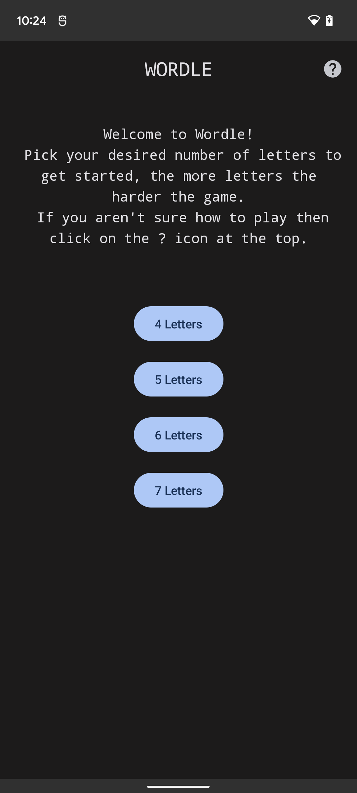
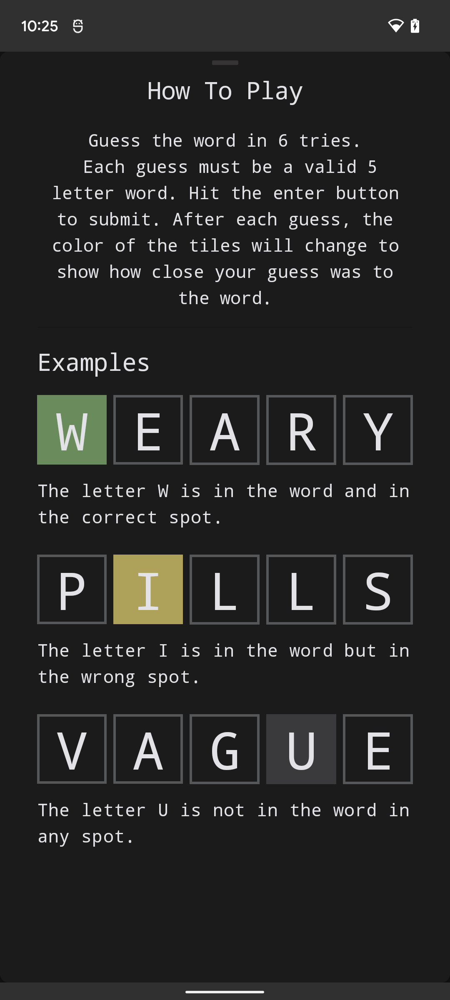
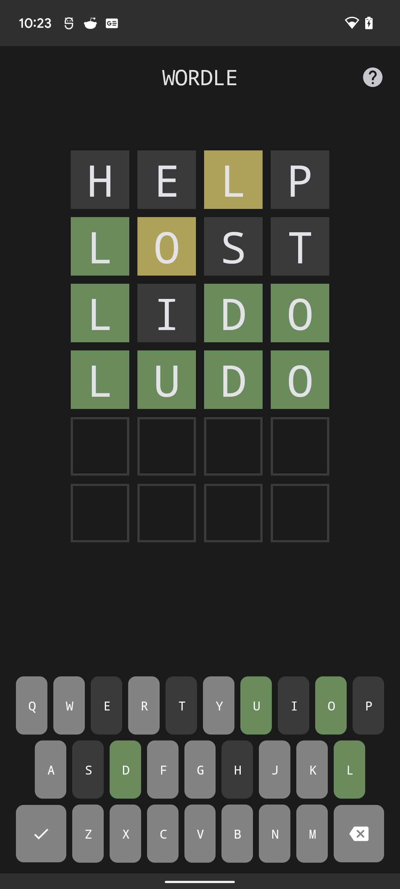

# Wordle (work-in-progress)

Wordle is a **work-in-progress** clone of the popular web
game [Wordle](https://www.powerlanguage.co.uk/wordle/)

## Android Development

Wordle is my testbed for the latest libraries and tools.

* Entirely written in [Kotlin](https://kotlinlang.org/).
* UI completely written in [Jetpack Compose](https://developer.android.com/jetpack/compose).
* Uses [Kotlin Coroutines](https://kotlinlang.org/docs/reference/coroutines/coroutines-guide.html).
* Uses many of the [AndroidX](https://developer.android.com/topic/libraries/architecture/) libraries,
  notably: ViewModels/Lifecycle, Navigation, & Room for storage.
* Uses dependency injection in the form of [Hilt](https://dagger.dev/hilt/)


## Screenshots
Start Screen:


Help Screen:


Game Screen:


## Work In Progress
As previously mentioned this is still under development, still to do: 

* Win & Lose states
* Give In & Restart
* Ability to define the answer
* Tests, tests, tests
* Better layout support - landscape, tablets, foldables
* Explore Compose for desktop.

## License

```
Copyright 2022 Scott Cooper

Licensed under the Apache License, Version 2.0 (the "License");
you may not use this file except in compliance with the License.
You may obtain a copy of the License at

    https://www.apache.org/licenses/LICENSE-2.0

Unless required by applicable law or agreed to in writing, software
distributed under the License is distributed on an "AS IS" BASIS,
WITHOUT WARRANTIES OR CONDITIONS OF ANY KIND, either express or implied.
See the License for the specific language governing permissions and
limitations under the License.
```